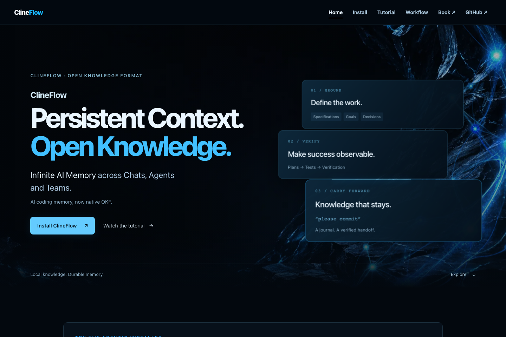
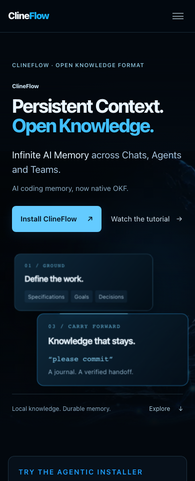

# ClineFlow: Living Knowledge

## GPT-6 capability test — user-directed implementation case study

This change records a qualitative capability demonstration requested by Hassan
Uriostegui: evolve an existing ClineFlow product site into a cinematic, mobile-friendly
experience, carry an approved design plan through implementation, validate it, and
deliver it through a reviewed pull request. The author reviewed the running preview
and approved the result before requesting the PR and merge.

This is **not a standardized or independently controlled model benchmark**. There
was no comparison model, fixed token/time budget, blinded scoring, or field-performance
study. The concrete evidence is the source diff, generated asset provenance,
reproducible browser checks, local measurements, screenshots, and author approval.

## Before → after

| Area | Previous experience | Living Knowledge |
| --- | --- | --- |
| Hero | One flattened image with embedded headline text | Separate rock/network layers, semantic typography, and three depth-aware knowledge panels |
| Motion | Independent hover effects and whole-section reveals | Shared Connect / Resolve / Carry forward vocabulary, bounded parallax, small reading-unit reveals |
| Mobile | Scaled artwork with desktop-style hover assumptions | Touch-friendly composition with fewer decorative panels and shallow scroll depth |
| Motion accessibility | Partial reduced-motion support | OS preference plus persistent page-to-page control; all scripted scrolling respects it |
| Workflow | JS-generated slides; hidden duplicate deck and episodes on homepage | 48 static lazy JPG slides on Workflow only, working without JS, page 1 start |
| Navigation | Separate implementations with incomplete mobile cleanup | Shared disclosure behavior, Escape focus restoration, resize cleanup, and active-section state |
| Typography | Strong borders/glows and some nested surfaces | Calmer weights, restrained hairlines, readable display hierarchy, and enlarged-text wrapping |

## Visual review

Desktop, 1440px:



Mobile, 390px:



## Capability dimensions exercised

- **Design synthesis:** translated the approved narrative into a consistent visual
  language instead of applying the same animation to every row.
- **Asset creation and integration:** produced two coordinated, text-free ImageGen
  assets; verified real alpha; created responsive WebP variants; preserved originals.
- **Frontend implementation:** delivered a shared controller and CSS depth without
  a framework, WebGL runtime, external animation library, or new visitor dependency.
- **Accessibility and resilience:** implemented OS/manual motion preferences, keyboard
  paths, focus handling, enlarged-text wrapping, static slides, and asset-failure behavior.
- **Verification and correction:** combined automated checks with rendered review.
  Visual inspection caught headline clipping at 200% text enlargement that a basic
  document-width check missed. The typography and test were improved to check actual
  text bounds. Mobile knowledge panels were made content-sized to avoid fixed-height
  overlap when text grows. Browser tests wait for asynchronous clipboard, resize,
  and media-query completion rather than asserting too early.
- **Delivery discipline:** isolated the implementation on its own branch, retained
  existing public content and links, documented evidence, and obtained visual approval
  before the requested PR-based integration.

## Implementation details

### Hero and motion

The hero pairs a distant obsidian texture with an independently moving transparent
blue network and native HTML knowledge panels. Headline text is selectable, accessible,
and responsive; no text was overlaid onto book or cover artwork. The panels illustrate
Ground / Verify / Carry forward, not a live installation or verification result.

Desktop pointer rotation is bounded at ±3°, pointer displacement at 24px, and scenic
scroll displacement at 48px. Mobile omits pointer/sensor interactions and caps scenic
scroll depth at 12px. No scroll hijacking, pinned sections, autoplay, or endless loops.

The shared animation scheduler coalesces updates into one requested frame, updates
only visible parallax scenes, and pauses when the document is hidden. Entrances run
once for small content units. Video players and deck slides remain flat. The book
cover receives shallow perspective without a fabricated spine; the author portrait
remains circular and borderless.

### Progressive enhancement

Content is visible before JS enhancement. Static deck markup retains all 48 pages
without JavaScript. Mobile navigation remains visible when JS is disabled. A failed
hero image removes the decorative imagery while retaining the semantic composition.
The motion preference survives page navigation and respects OS accessibility settings.

The existing copy action, seven-source testimonial lightbox, PDF downloads, Vimeo
embeds, metadata, author information, navigation destinations, and approved artwork
are preserved. Obsolete hidden workflow content and competing reveal handlers were
removed from the homepage. Both pages now use the same behavior implementation.

### Asset budget

| Selected hero assets | Bytes | Planned ceiling |
| --- | ---: | ---: |
| Desktop pair, 1536 × 1024 each | 343952 | 1MB |
| Mobile pair, 768 × 512 each | 97858 | 450KB |

These figures cover the **new selected hero pair**, not the entire page, video traffic,
or screenshot documentation. Images have reserved dimensions; below-the-fold content
uses native lazy loading. The network WebPs retain alpha.

Full prompts, asset filenames, and design decisions are recorded in the
[implementation journal](../../knowledge/journals/living-knowledge-motion.md).

## Verification evidence

Final local Chromium run on 2026-09-05:

| Check | Result |
| --- | --- |
| Homepage + Workflow at 360, 390, 768, 1440, 1920px | PASS; no horizontal document overflow |
| In-page nav destinations, sticky offsets, active state | PASS |
| Mobile open/close, Escape focus return, breakpoint cleanup | PASS |
| Book/GitHub destinations and new-tab attributes | PASS |
| Clipboard contents and visible confirmation | PASS |
| Image dialog, seven source links, Escape, focus restoration | PASS |
| Deck starts at 1; equal button widths; next/previous and boundaries | PASS |
| ArrowRight, Home, End; emulated touch swipe | PASS |
| OS reduced motion, manual preference, cross-page persistence | PASS |
| No-JS navigation and static deck | PASS |
| Failed/delayed hero assets | PASS |
| 200% headline text bounds | PASS |
| Idle animation scheduling | No perpetual requested-frame loop |
| Local 100-frame desktop scroll sample | CLS 0; p95 frame interval 12.5ms; 0 frames over 50ms |
| Page-script errors / failed local asset responses | 0 / 0 |
| JS syntax, diff whitespace, structured-data parse, local references | PASS |

The performance sample is a local lab observation, **not a Lighthouse score, Core Web
Vitals field result, or a guarantee on all devices**. The browser test counts page-script
errors and local asset failures; it does not certify third-party Vimeo availability or
behavior. Touch was emulated in Chromium; physical iOS/Android and Safari/Firefox were
not separately verified. Existing external destinations were preserved and inspected,
not transacted with. No user telemetry or external analytics were introduced.

## Reproduce

From the public companion repository, serve the static site:

```sh
python3 -m http.server 4175 --bind 127.0.0.1
```

With an existing Playwright installation (and Chromium installed), in another terminal:

```sh
node --check site.js
git diff --check
NODE_PATH=/path/to/node_modules \
PREVIEW_URL=http://127.0.0.1:4175/ \
PREVIEW_ARTIFACT_DIR=/tmp/clineflow-motion-qa \
node tests/living-knowledge.cjs
```

The suite emits a JSON result and desktop/mobile review screenshots. Playwright is
a development-only test tool; it is not part of the delivered site's runtime.

## Integration and rollback

The author requested a documented PR followed by merging that PR to main, replacing
the earlier direct-merge request. The public site remains a static GitHub Pages project;
no backend, migration, secret, paid service, or hosting change is required. Reverting
the PR restores the previous presentation because the original artwork is retained.
